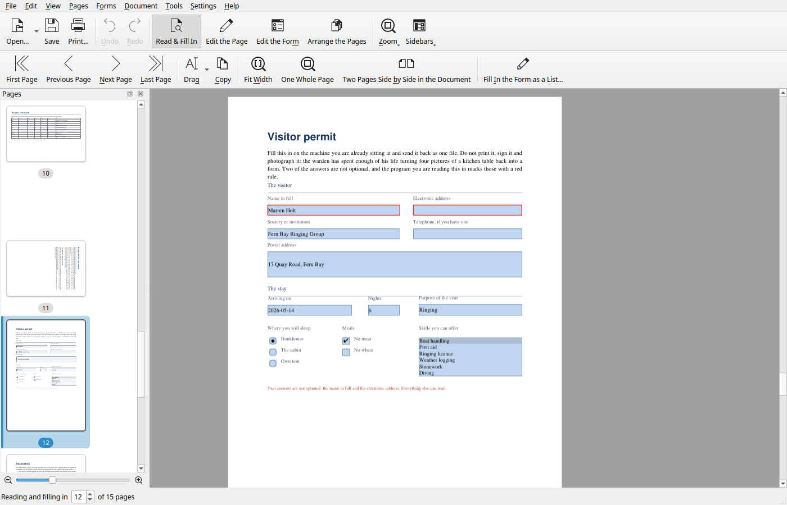
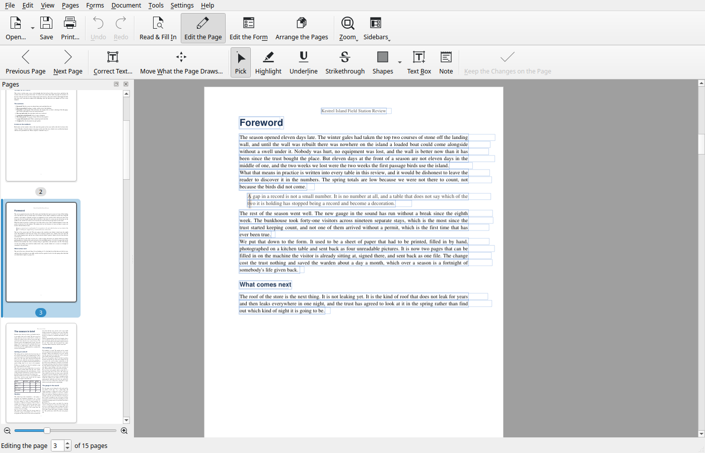
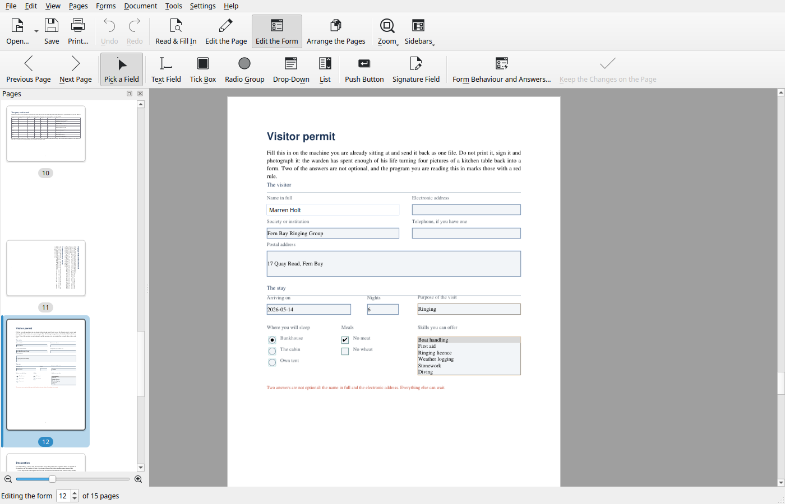
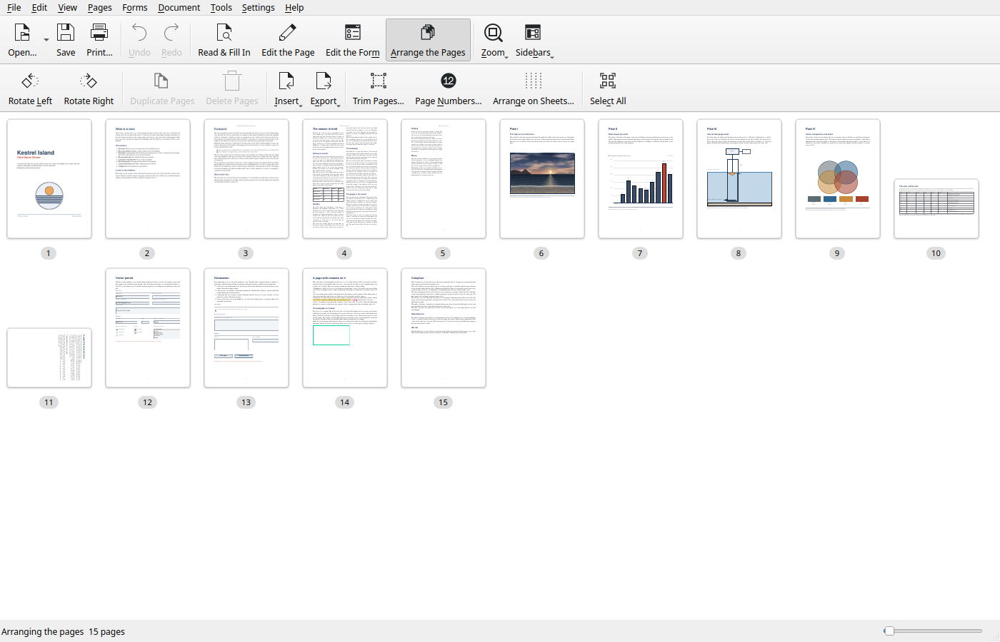

<div align="center">


# PDF Smithy

**A native PDF editor for Linux. Everything happens on your own machine.**

[](https://github.com/tombueng/pdf-smithy/actions/workflows/ci.yml)
[](LICENSING.md)
[](https://www.qt.io/)
[](https://develop.kde.org/)

</div>

## What it is

Editing a PDF on Linux usually means one of three things. Assembling five
single-purpose tools, none of which knows what the others did. Uploading a
contract, a payslip or a medical letter to somebody else's server because that
was the quickest way to merge two files. Or paying for an application that
works but never quite belongs on the desktop.

PDF Smithy does the whole job in one program: reading, correcting the words on
a page, designing and filling in forms, marking up, arranging pages, prepress,
archiving and redaction. It is written in C++20 against Qt 6 and KDE Frameworks
6, it ships a command line that covers everything the window does, and it is
aiming at the work people currently buy Acrobat Pro for.

Nothing is ever uploaded. The Flatpak manifest asks for no network permission
at all, which is the sandbox saying the same thing the program does.

## Screenshots

<div align="center">

| Read and fill in | Edit the page |
|---|---|
|  |  |
| **Edit the form** | **Arrange the pages** |
|  |  |

</div>

## Four ways to work

The window has four modes on F5 to F8, and the second toolbar row changes with
them, so the tools on screen are the tools that do something to the document on
screen.

| Mode | Key | What it is for |
|---|---|---|
| **Read and Fill In** | `F5` | Turn the pages, select and copy text, fill in forms. Nothing can be changed by accident. |
| **Edit the Page** | `F6` | Correct the words, move the pictures, mark the page up. |
| **Edit the Form** | `F7` | Draw form fields onto the page, move them, set what they do. |
| **Arrange the Pages** | `F8` | Reorder, turn, duplicate and throw away whole pages. |

## What it can do

### Read and fill in

Continuous or facing pages, zoom to width, to height, to one page or to two,
free zoom, and a pan tool. Text selection and area selection. A thumbnail strip
for navigation, a sidebar holding the document's own bookmarks (click to jump,
rename in place, nest, reorder, all of it on the same undo stack as everything
else, and it can offer a whole table of contents inferred from the headings
when a document has none), and an inspector that names whatever you last
clicked and lists its attributes.

Comments made in the other modes are readable here and a note gives up its
text, but nothing can be drawn, moved or deleted, so handing somebody the
program in reading mode is safe.

Forms are filled in on the page itself: clicking a field puts a real text box,
text area or drop-down over that field's rectangle at that field's size, and a
tick box needs no widget because a click is the whole interaction. Locked
fields and signature fields are drawn dashed and grey rather than hidden,
because "why can I not type here" deserves an answer on the page. Required
fields get a red edge. A field with no name of its own borrows the words
printed beside it, and that guess is shown as a guess and never written into
the file. There is also a list view that puts the field list beside the page
and cross-selects between them, and that is where answers can be made
permanent.

### Edit the page

**Text, live and in place.** Click into a line and type. Where the document
carries its glyphs, that very font programme is handed to the toolkit, so the
letters under the caret are the letters the page draws, at the size and in the
colour the page draws them. Where it does not, the closest face on the machine
is chosen from what the document says about its own. Every editable run is
outlined faintly before anything is clicked, so the shape of what can be
changed is visible rather than discovered by surprise, and a run that cannot be
changed is outlined dotted and says why when you click it.

Beside the caret sit the controls that change how the line is set: the typeface
(the page's own, or any family installed on the machine), the size in points,
bold and italic, the colour, and a "Set as the page does" button that puts it
all back. Choosing a system face embeds it, cut down to the characters actually
asked for, and refuses at the moment you pick it if that face cannot travel in
a PDF, rather than at save time. A padlock beside the caret decides whether a
line that grows may get longer or must stay in its box.

It is not a painted preview. A third of a second after the last keystroke the
edit is written to a scratch copy of that page and the page is rendered back
from it, so what is on the screen from then on is the file.

**Objects with handles.** Everything the page draws can be picked up: pictures,
shapes, text and vector art, each lighting up under the pointer and getting
eight grips and a turn handle when chosen. Move by dragging or by the arrow
keys, resize from a corner or an edge, rotate with a snap every fifteen
degrees, change the ink of text and shapes and the line width of shapes,
delete, cut, copy and paste, including to and from other programs. Several at
once can be aligned, distributed and matched in size. Any single object's
change can be taken back on its own. A picture carries its own colours and
takes no notice of one set here, and the panel says so rather than offering a
control that does nothing.

Dragging moves the real ink rather than a wireframe: the page is rendered once
without the object and once with the object alone, so the thing under the
cursor is the thing the file draws. New text, pictures, rectangles, ellipses
and lines are added from "The Page as a List", which shows the page as a table
beside the rendering, or from the command line; on the page itself new content
arrives by pasting.

**Mark-up.** Highlight, underline, strike out, rectangles, ellipses, lines,
freehand, text boxes and sticky notes, each written with its own appearance so
it looks the same in every reader. Comments can be saved to and loaded from a
file.

### Edit the form

Seven kinds of field: text, tick box, radio group, drop-down, list, push button
and signature. Pick one from the toolbar, drag out the box it is to occupy,
then move it, resize it by its corners, nudge it with the arrow keys, and align,
distribute or match the size of several at once. Consecutive radio drags join
one group until you say otherwise.

What a field is and how it looks: required, read-only, multiline, password,
comb, maximum length, the options it offers and the values they export, a
default, the font and size (zero means the reader fits the text to the box),
text, background and border colours, border width and style, and alignment.

What a field does: tab order per page; formatting as a number, currency,
percentage, date, time, postcode or telephone number; refusing a number outside
a range; working a value out of other fields as a sum, product, average,
minimum or maximum; and buttons that empty the form, send the answers, jump to
a page or open an address.

Answers go out to FDF, XFDF or CSV and come back in the same way, many filled-in
copies can be gathered into one table, and the fields of an empty form can be
copied onto a document of the same layout.

The design view is not an approximation. A third of a second after the last
change, the page and the work waiting to be written are put into a scratch PDF,
rendered, and shown back, so what is on the screen is what the file will say.

### Arrange the pages

Reorder by dragging, across several open documents at once, because the engine
holds any number of open sources and one ordered list of page references:
merging is the normal state of affairs rather than a special operation, and
reordering a 2000-page file costs a vector shuffle. Rotate, duplicate, delete,
extract, insert another file, add blank pages, import images as pages. Crop,
number (including Bates stamping), arrange several pages on one sheet as a
file, and split by count, by ranges, at bookmarks, or into pieces small enough
to email.

Everything works on a selection. Pick one page or fifty: OCR, compression,
signing, watermarking and redaction all act on what you chose, and each is a
single undo step.

### Look the whole document over

| Tool | What it answers |
|---|---|
| **Check the Document** | Runs a preflight profile, lists what it found by severity, offers a fix per row that you tick or do not, writes a report as a PDF, and keeps a panel headed "What was not checked", because the rules a run could not judge decide whether the rest can be trusted. |
| **Colour** | What the document does with colour; conversion to grey, black and white, RGB or CMYK; swapping one colour for another everywhere; renaming, merging and dissolving spot inks; thickening hairlines; black overprint; and rendering a single plate. |
| **Fonts** | Every font, where it is used and what is wrong with it. Supply a missing face from the system, write `/ToUnicode` maps so text can be copied, join duplicate subsets, throw embedded glyphs away, and embed a system font cut down to the characters asked for. |
| **Pictures** | Every picture with the resolution it really has, addressed by page and name. Recompress, resample, adjust brightness, contrast, gamma, sharpening and despeckling, crop pixels away for good, replace, remove, turn without re-encoding, and merge duplicates. |
| **Page Setup** | The five page boxes first, then paper size, bleed and printer's marks, tiling one page across several sheets, printer's spreads, overlaying one document on another, page labels, and finding pages that paint nothing. |
| **Set Text as Pages** | The odd one out: turns a plain text or Markdown file into a typeset PDF, with columns, running heads, hyphenation and a live preview that is the real engine writing a real file. |
| **Compare with** | Two documents side by side. Words are diffed by longest common subsequence, never by set difference, so a reordering is reported as a change, and the changed pixels are marked. |
| **Document Properties**, **Clean Up**, **Password** | Metadata; stripping metadata, JavaScript and embedded files; and AES-256 encryption. Older schemes are not offered, because they are broken to the point where offering them would dress a document up as protected when it is not. |

### Sign, watermark and stamp

Capture a signature once, photographed, scanned or drawn, and the paper around
a scan is made transparent for you. Then drag it onto the page, at the size and
in the place you want, on whichever pages you choose. Signatures are kept as
PNG files in the application's data directory rather than buried in a config
file, because an image belongs somewhere the user can find, back up and delete
it, and they never leave the machine. Watermarks go across the page as text or
a picture, at any angle and strength, solid or as an outline. Page numbers,
running heads and Bates stamping have a tool of their own.

### Print

Most viewers hand the file to CUPS and call that printing. That works until you
want two pages on a sheet, a booklet, or only the odd sides. So the imposition
happens here and the printer only ever sees finished sheets: page ranges; two,
four, six, nine or sixteen up; booklets in folding order; odd or even sides
only, for manual duplex on a simplex printer; fit to page, shrink to fit,
actual size or a scale of your own; and greyscale. There is a print preview
first. "Arrange on Sheets" does the same thing as a file rather than to paper,
for handouts and reading copies, and because the pages are placed rather than
re-rendered the text on them stays selectable.

### Get the content back out

Export as images at a chosen resolution, as plain text, as HTML, as Markdown,
or with the tables pulled out into a spreadsheet. Save for the web (linearised,
so page one arrives first over a slow link), for commercial printing (PDF/X-1a,
X-3 or X-4) or for archiving (PDF/A-1b, 2b or 3b).

### Take content out for good

A black rectangle drawn over a name is not redaction. Redaction here takes the
content out of the page's instruction stream and only then paints the box.
Text goes glyph by glyph, with each removed glyph replaced by an equivalent
spacing number so the rest of the line does not move. Overlapping pictures are
decoded, painted out in their own pixels and re-embedded. Where a picture
cannot be decoded, the page is flattened or the picture is removed, and the
report says which. It errs deliberately towards removing too much.

### Make scans searchable

Text recognition adds an invisible text layer over the picture of the page.
The page itself is never re-rendered: a scan that goes in at 600 dpi comes out
with the very same image bytes. Crooked pages are straightened by wrapping a
transformation matrix around the existing content, not by resampling, so
nothing softens. Pages that already carry text are skipped by default, since
running recognition over a digitally generated page adds a second, slightly
wrong text layer, which is the classic way to ruin a searchable document.

## The command line

Anything the window can do to a document, a script can do too. That is a design
rule of the project, not a bonus: new document operations go into the engine,
not into the window, so both front ends reach them. There are 110 commands.

```
info  merge  split  pages  compress  ocr  sign  watermark  meta  protect
from-images  export-images  number  crop  redact  nup  annotate  outline
form  text  batch  compare  archive  archive-check  linearise  set-version
tables  to-csv  to-text  to-html  to-markdown  to-svg  to-pdfx  typeset
colour …  field …  fonts …  images …  layout …  objects …  preflight …
```

```bash
# Glue documents together
pdf-smithy-cli merge chapter1.pdf chapter2.pdf -o book.pdf

# One file per invoice
pdf-smithy-cli split invoices.pdf --every 1

# Keep some pages, turn one of them
pdf-smithy-cli pages report.pdf --keep 1-3,7,12-last --rotate 4:90 -o short.pdf

# Make a scan searchable and straight
pdf-smithy-cli ocr scan.pdf --languages deu+eng --straighten -o searchable.pdf

# Correct a line of text in the page's own font
pdf-smithy-cli text letter.pdf --replace "1:4=Dear Ms Meier" -o fixed.pdf

# Check against a profile, and mend what can be mended
pdf-smithy-cli preflight artwork.pdf --profile print-ready --fix -o mended.pdf

# One operation over a folder full of files
pdf-smithy-cli batch scans/*.pdf --op ocr --out-dir searchable/
```

Page ranges accept `1-4`, `8`, `12-last`, `odd`, `even`, and `9-1` to reverse.
`--json` makes the output machine-readable. Seven of the groups answer
`limits` or `limitations` and print, in plain words, what that part of the
program cannot promise.

Full details: `man pdf-smithy-cli`, or `pdf-smithy-cli --help`. The manual's
command table is generated from the program itself and checked on every build,
so it cannot drift.

## What is different about it

**Editing is lossless.** Reordering a scanned contract does not re-encode it.
An object that is moved or restyled is wrapped in the change rather than
rewritten, so everything else on the page keeps its bytes. Colour is rewritten
operator by operator, and the glyphs, the paths and the structure come out
untouched. Saving the same document twice produces identical files.

**Nothing leaves the machine.** No account, no upload, no telemetry, and a
Flatpak that is not permitted to open a socket even if it wanted to.

**The licensing is layered on purpose.** The engine is MIT and never includes a
Poppler header; rendering reaches it through a pure interface, and the one
GPL-linked directory is the Poppler backend behind that interface. On the day a
permissively licensed renderer is packaged by distributions, swapping the
backend is a single new class. See [LICENSING.md](LICENSING.md).

**It says what it cannot do.** Refusals name the reason, preflight keeps a
list of the rules it could not judge, PDF/A inspection is called a look rather
than a validation because veraPDF is what signs a file off, and seven command
groups will print their own limits on request.

**Errors inform, they do not interrupt.** Failures appear in a message bar
above the document. A modal box you have to dismiss before you can even look at
your document is treated as a bug.

## Installing

### From source

Nothing is published to a distribution repository yet, so the honest one-liner
is the one that builds it. Each of these installs the dependencies, clones the
repository, builds and installs.

**Debian, Ubuntu, Kubuntu, Mint**

```bash
sudo apt install -y build-essential cmake ninja-build git pkgconf gettext extra-cmake-modules qt6-base-dev qt6-tools-dev libkf6coreaddons-dev libkf6xmlgui-dev libkf6config-dev libkf6configwidgets-dev libkf6i18n-dev libkf6kio-dev libkf6crash-dev libkf6iconthemes-dev libkf6widgetsaddons-dev libkf6guiaddons-dev libkf6doctools-dev libpoppler-qt6-dev libqpdf-dev libtesseract-dev libleptonica-dev liblcms2-dev ghostscript tesseract-ocr-eng breeze-icon-theme && git clone https://github.com/tombueng/pdf-smithy.git && cmake -S pdf-smithy -B pdf-smithy/build -G Ninja -DCMAKE_BUILD_TYPE=Release && cmake --build pdf-smithy/build && sudo cmake --install pdf-smithy/build
```

**Fedora**

```bash
sudo dnf install -y gcc-c++ cmake ninja-build git pkgconf-pkg-config gettext extra-cmake-modules qt6-qtbase-devel qt6-qttools-devel kf6-kcoreaddons-devel kf6-kxmlgui-devel kf6-kconfig-devel kf6-kconfigwidgets-devel kf6-ki18n-devel kf6-kio-devel kf6-kcrash-devel kf6-kiconthemes-devel kf6-kwidgetsaddons-devel kf6-kguiaddons-devel kf6-kdoctools-devel poppler-qt6-devel qpdf-devel tesseract-devel leptonica-devel lcms2-devel ghostscript tesseract-langpack-eng breeze-icon-theme && git clone https://github.com/tombueng/pdf-smithy.git && cmake -S pdf-smithy -B pdf-smithy/build -G Ninja -DCMAKE_BUILD_TYPE=Release && cmake --build pdf-smithy/build && sudo cmake --install pdf-smithy/build
```

**Arch, Manjaro, EndeavourOS**

```bash
sudo pacman -S --needed --noconfirm base-devel cmake ninja git extra-cmake-modules qt6-base qt6-tools kcoreaddons kxmlgui kconfig kconfigwidgets ki18n kio kcrash kiconthemes kwidgetsaddons kguiaddons kdoctools poppler-qt6 qpdf tesseract leptonica lcms2 ghostscript tesseract-data-eng breeze-icons && git clone https://github.com/tombueng/pdf-smithy.git && cmake -S pdf-smithy -B pdf-smithy/build -G Ninja -DCMAKE_BUILD_TYPE=Release && cmake --build pdf-smithy/build && sudo cmake --install pdf-smithy/build
```

**openSUSE Tumbleweed**

```bash
sudo zypper --non-interactive install gcc-c++ cmake ninja git pkgconf-pkg-config gettext-tools kf6-extra-cmake-modules qt6-base-devel qt6-tools-devel kf6-kcoreaddons-devel kf6-kxmlgui-devel kf6-kconfig-devel kf6-kconfigwidgets-devel kf6-ki18n-devel kf6-kio-devel kf6-kcrash-devel kf6-kiconthemes-devel kf6-kwidgetsaddons-devel kf6-kguiaddons-devel kf6-kdoctools-devel libpoppler-qt6-devel qpdf-devel tesseract-ocr-devel leptonica-devel liblcms2-devel ghostscript tesseract-ocr-traineddata-eng kf6-breeze-icons && git clone https://github.com/tombueng/pdf-smithy.git && cmake -S pdf-smithy -B pdf-smithy/build -G Ninja -DCMAKE_BUILD_TYPE=Release && cmake --build pdf-smithy/build && sudo cmake --install pdf-smithy/build
```

Four of those are optional, and they are in the list because a feature lost
quietly is worse than one more package to install. Ghostscript is run as a
separate process by image compression and by PDF/A and PDF/X conversion. The Tesseract
language data is what text recognition reads: add the languages you need, for
example `tesseract-ocr-deu`, `tesseract-langpack-deu`, `tesseract-data-deu` or
`tesseract-ocr-traineddata-deu`. Little CMS does ICC colour conversion in
process, and without it that work is handed to Ghostscript, which cannot honour
a page selection. The Breeze icons matter away from Plasma, where a KDE
application asks the icon theme for names such as `object-rotate-right` and
gets nothing back, which looks like an empty toolbar rather than an error.

### From a release

There are no releases yet. Once a version tag has been pushed, CI attaches a
Debian package, a Flatpak bundle and an AppImage to it, and these will work:

```bash
# Debian package
gh release download --repo tombueng/pdf-smithy --pattern '*.deb' && sudo apt install -y ./pdf-smithy_*.deb

# Flatpak bundle
gh release download --repo tombueng/pdf-smithy --pattern '*.flatpak' && flatpak install --user ./io.github.tombueng.PdfSmithy.flatpak

# AppImage
gh release download --repo tombueng/pdf-smithy --pattern '*.AppImage' && chmod +x pdf-smithy-*.AppImage && ./pdf-smithy-*.AppImage
```

See [packaging/README.md](packaging/README.md) for what each artefact contains
and how to build one yourself.

## Building

```bash
cmake -S . -B build -G Ninja -DCMAKE_BUILD_TYPE=Debug
cmake --build build
ctest --test-dir build --output-on-failure
```

Three options are worth knowing: `PS_BUILD_GUI`, `PS_BUILD_CLI` and
`PS_WITH_OCR`, all on by default. Without Tesseract and Leptonica the build
drops text recognition rather than failing, and without KF6 KDocTools it drops
the handbook, on the grounds that a program missing one feature beats a build
that will not finish on a minimal system.

The test suite needs a little more than the build does: `xvfb`, `ghostscript`,
the URW base 35 fonts, the English and German Tesseract data, `appstream`,
`python3`, `libxml2-utils`, `docbook-xml`, and every locale, because each C++
test is registered twice, once under `LC_ALL=C` and once under `de_DE.UTF-8`.
Nearly every one of these tests reports itself as passing when its tool is
absent, so install them before trusting a green run. `debian/control` carries
the exact list.

## What it does not do

Three of these come up often enough to say at the front rather than leave to be
discovered.

**Type is set per run, not per selection.** A change of typeface, size, weight
or colour applies to a whole text run, which is usually a line and sometimes
less. Selecting three words in the middle of a line and making only those bold
is not offered.

**There is no bold or italic of the page's own face.** A cut is a separate font
programme, and a document carries the one it was made with. Bold and italic are
therefore available only once you pick a typeface from the system, and the
checkboxes say so rather than sitting there doing nothing.

**Type 3 fonts cannot be substituted.** Their letters are drawings made with
the document's own operators, so there is no font programme to supply in place
of one that has gone missing. Composite fonts, the kind used for Chinese and by
most modern producers, cannot be substituted either: their codes are glyph
numbers with no meaning outside the font programme that is absent. Both are
named in the report rather than guessed at.

Beyond those: text does not reflow, because nothing in a PDF records which line
follows which, so a replacement longer than what it replaces is squeezed to fit
and only so far; what lies on top of what cannot be changed yet, since that
means moving whole blocks of drawing operators and on a real page they are
often not properly enclosed; asking for a character the document's font does
not hold is refused rather than drawn wrongly; text inside an embedded drawing,
and text that is part of a scanned picture, cannot be edited this way;
preflight is a check and not a certification, and a file that passes here can
still be refused by veraPDF; form formatting, validation and calculation are
JavaScript, which PDF/A forbids and some readers do not run; form fields use
the fourteen standard fonts only; comparison pairs pages by position, so
inserting a page reports the tail as changed; and PDF/A, PDF/X and some colour
work run Ghostscript as a separate process rather than doing it in-tree.

Each part of the engine will tell you its own limits, in plain words:

```bash
pdf-smithy-cli fonts limits
pdf-smithy-cli colour limits
pdf-smithy-cli layout limits
pdf-smithy-cli objects limits
pdf-smithy-cli preflight limitations
pdf-smithy-cli images limitations
pdf-smithy-cli field limitations
```

## Contributing

Bug reports, translations and patches are all welcome. Every bug gets a test
before it gets a fix, every operation is undoable, no operation re-renders a
page, and anything the window can do the command line can do. The reasoning
behind each of those, and the code style, is in
[CONTRIBUTING.md](CONTRIBUTING.md).

The interface is fully translated into German and English, by hand rather than
by machine. A new language needs one `.po` file; the steps are in
[CONTRIBUTING.md](CONTRIBUTING.md#translating).

## Licence

GPL-3.0-or-later for the application, MIT for the reusable engine. Every file
carries an SPDX header, so the licence of any file is stated in the file
itself. The reasoning, and what you may do with the engine on its own, is in
[LICENSING.md](LICENSING.md).
